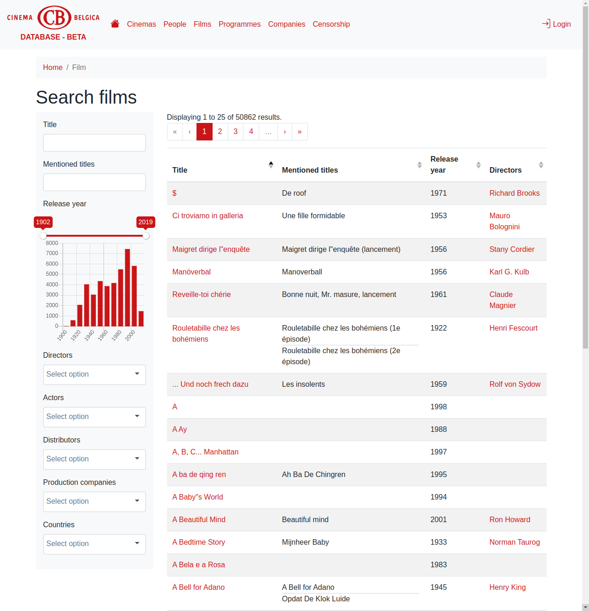
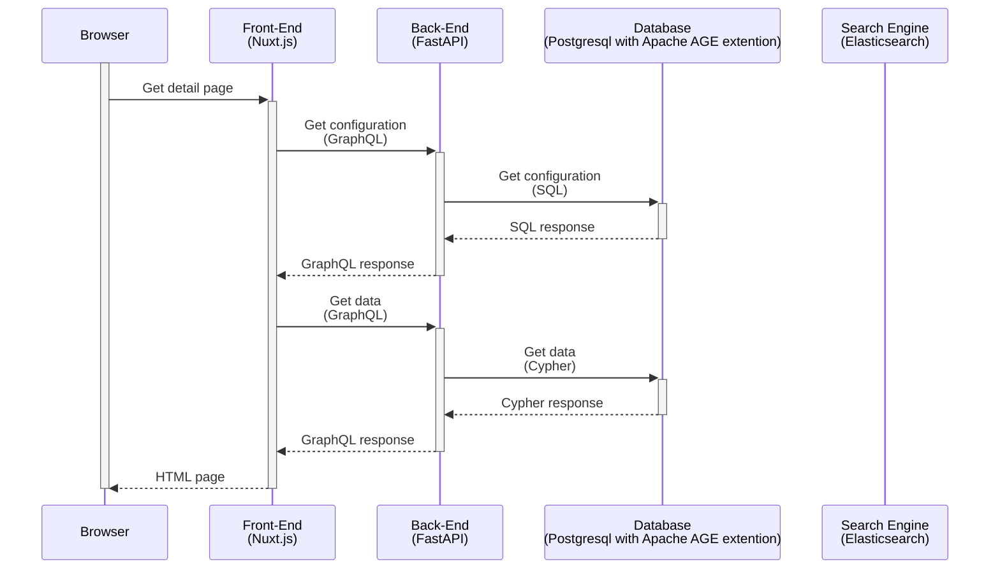
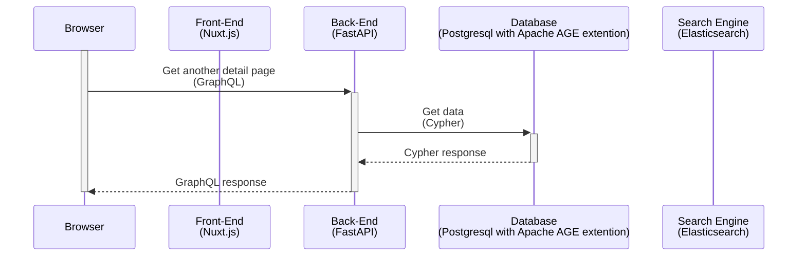
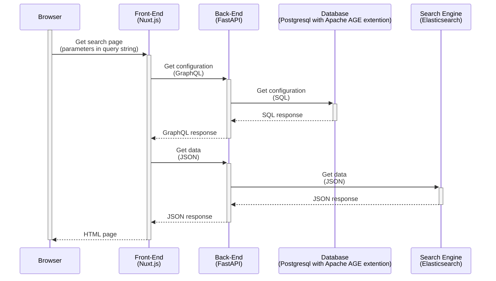
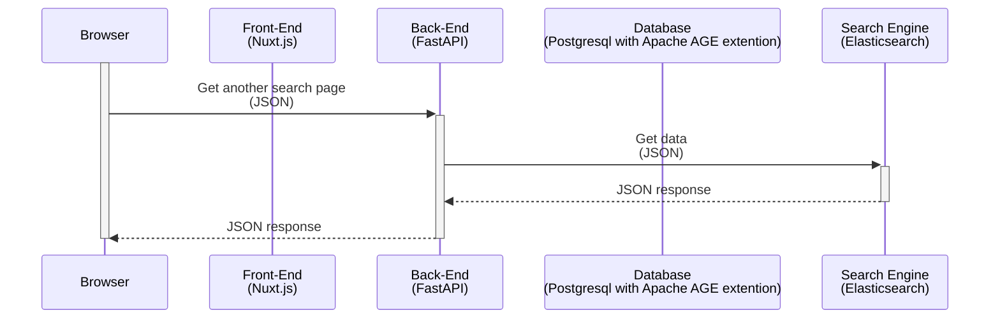
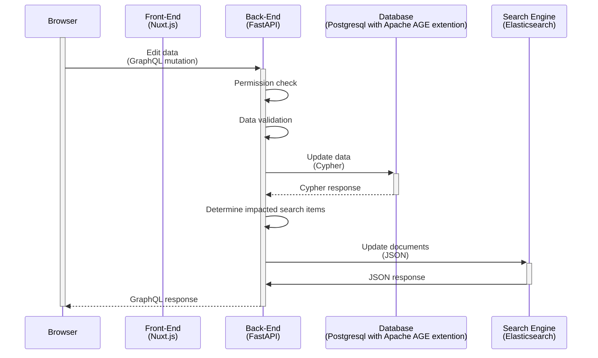

# TripleHop

TripleHop is a platform that aims to facilitate collaborative research data creation and publication.

## General architecture

TripleHop constists of a separate [Front-end](https://github.com/GhentCDH/triplehop_frontend) ([Nuxt.js](https://nuxtjs.org/)) and [Back-end](https://github.com/GhentCDH/triplehop_backend) ([FastAPI](https://fastapi.tiangolo.com/)) implementation, who communicate with each other using GraphQL. Data is stored in a [PostgreSQL](https://www.postgresql.org/) database with the [Apache AGE](https://age.apache.org/) graph extension. [Elasticsearch](https://www.elastic.co/elasticsearch/) is used for the search pages with faceted navigation.

Some [Import Tools](https://github.com/GhentCDH/triplehop_import_tools) have been developed to facilitate the import of configuration and data files.

Nuxt.js allows Vue.js applications to be rendered on the server side on the initial request. This enables pages to be indexed by search engines and cached by web servers. After the first request, the Vue.js application is loaded in the browser and subsequent requests can be done by the Vue.js application, enhancing the user experience and minimizing network traffic.

### Initial detail page request

### Subsequent detail page requests

### Initial search page request

### Subsequent search page requests

### Edit data

## Work in progress

The TripleHop platform is still a work in progress.

Currently implemented:

* Data model configuration using json files
* Basic exploration of data
* A part of the editing interface
* Data import using import scripts
* Limited GraphQL API

TO DO:

* Documentation
* Testing
* Data model configuration with a web interface
* Editing sources
* Data import using a web interface
* LOD presentation
* LOD mapping
* HDT export
* Plug-in system in the back-end and front-end, re-evaluation of the data model configuration format
* Graph visualizations
* Visual query interface

## Contributing

Please see our [contributing guidelines](CONTRIBUTING.md).

## Acknowledgements

TripleHop is and has been funded by

* [Clariah-VL](https://clariahvl.hypotheses.org/)
* [Cinema Belgica](https://www.cinemabelgica.be/)
* [Novel Echoes](https://research.flw.ugent.be/en/projects/novel-echoes)
